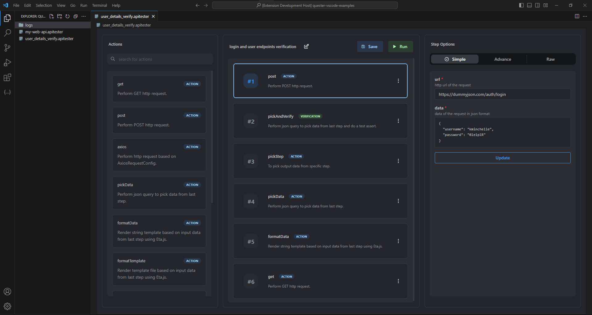

# Quester - vscode

A simple rest api testing tool. Crafted with easy to use actions and verification steps, so you can test you api workflows with simple drag and drop UI.

🛠️ _This project is still in alpha stage and there might be breaking changes in stable release._ 🛠️

[Download](https://marketplace.visualstudio.com/items?itemName=9paradox.quester-vscode) from Visual Studio Code marketplace.

### Quick start
1. Create a new file with extension `.apitester`. Example `my-api-verification.apitester`.
2. Drag and drop actions from Actions list into the testcase.
3. Set your options for each steps you add to the testcase.
4. Click the `Run` button to run the testcase.
5. Finally click `Save` to save the testcase.

# apitester

Quester uses [apitester](https://github.com/9paradox/apitester) package to build and run the test-cases. Checkout [apitester](https://github.com/9paradox/apitester) for more details.

## Contribution

Contributions are always welcome.

## License

[MIT](https://choosealicense.com/licenses/mit/)
